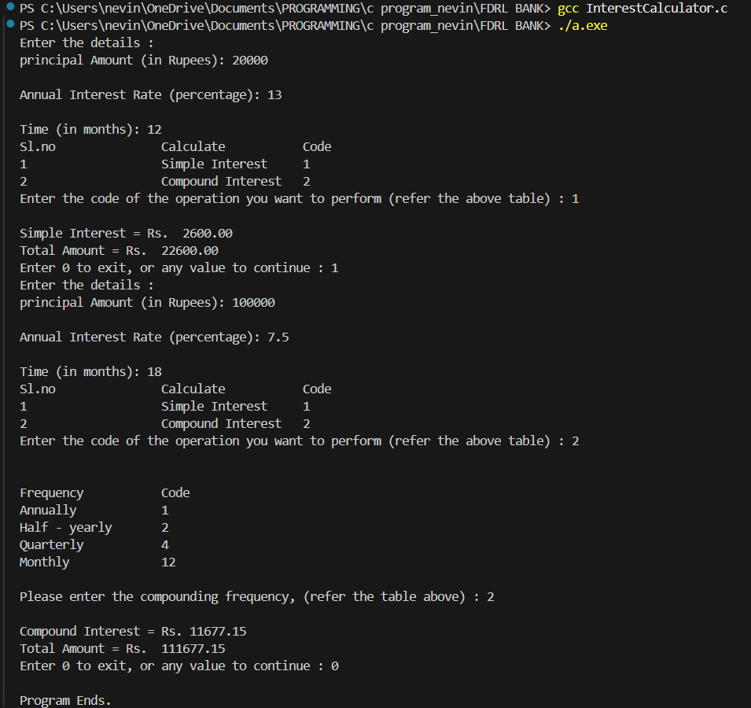
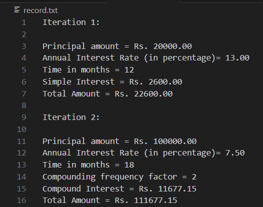

# **Banking Interest Calculator**
A C program that calculates Simple Interest and Compound Interest with transaction logging, demonstrating core banking software principles.

## **Illustrations**
Here's a quick look at the program in action:
### **Input prompt (terminal view)**
#### This shows the terminal window where the user has provided the necessary inputs<br>


### **Record File (record.txt) After Execution**
#### This is the content of the `record.txt` file after running the program. It logs the calculations, including the inputs, the interest type being calculated,  and the final results

## **Features**
- **Dual Calculation Modes**
  - Simple interest.
  - Compound interest (supports custom compounding frequencies).
- **Transaction Logging**
  - Automatically saves all transactions to `record.txt`.
- **Input Validation**
  - Ensures valid inputs and prevents negative values.

## **Requirements**
- GCC compiler (`gcc --version` to verify).
- A terminal (Linux/macOS or Windows WSL).
- Visual Studio Code text editor (optional).

## **Installation & Usage**
```bash
git clone https://github.com/nevinbeno/Interest-Calculator.git #clone repository
cd Interest-Calculator
```

## **Steps to Compile and Run (BASH)**
1. **Open Terminal**:
2. **Compile**:<br>
```bash
gcc InterestCalculator.c -o InterestCalculator -lm  # math.h requires lm flag
```
3. **Run**<br>
```bash
./InterestCalculator
```
## **Using Visual Studio Code (Alternative way)**
1. **Open integrated terminal in Visual Studio Code.**
2. **Compile**
```bash
gcc InterestCalculator.c
```
3. **Run**
```
./InterestCalculator
```
## Applications
- Implements RBI-compliant interest calculations
- Demonstrates financial transaction logging
- Shows robust input validation techniques